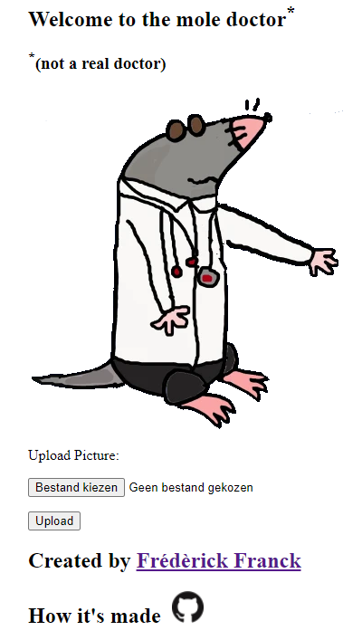

# Mole Detection App

# Description

This a web app that classifies moles based on images. It uses transfered learning on the deep learning model MobileNetV2 and is trained on the this [dataset](https://www.kaggle.com/datasets/kmader/skin-cancer-mnist-ham10000). 

The model is trained and then saved so it can be loaded in the Flask application and used for predictions.


# Usage

Website: https://mole-doctor.herokuapp.com/ (Might not be running because of Heroku's memory limit).

# Installation


Install required packages.

```bash
pip install -r project/requirements.txt
```

This script will build and save the model. This needs to be done at least once before hosting the app locally or in docker.
```bash
python model_building.py
```

Host the app locally, it will be running on [localhost](http://localhost:5000/)

```bash
python app.py
```

## Docker

Build the docker image
```bash
docker build . -t mole-doctor
```

Deploy the docker image to a container and run locally.
App will be running on [localhost](http://localhost:5000/)

```bash
docker run -d -p 5000:5000 mole-doctor
```

You should see the mole doctor if the application is running correctly




# Work in progress...